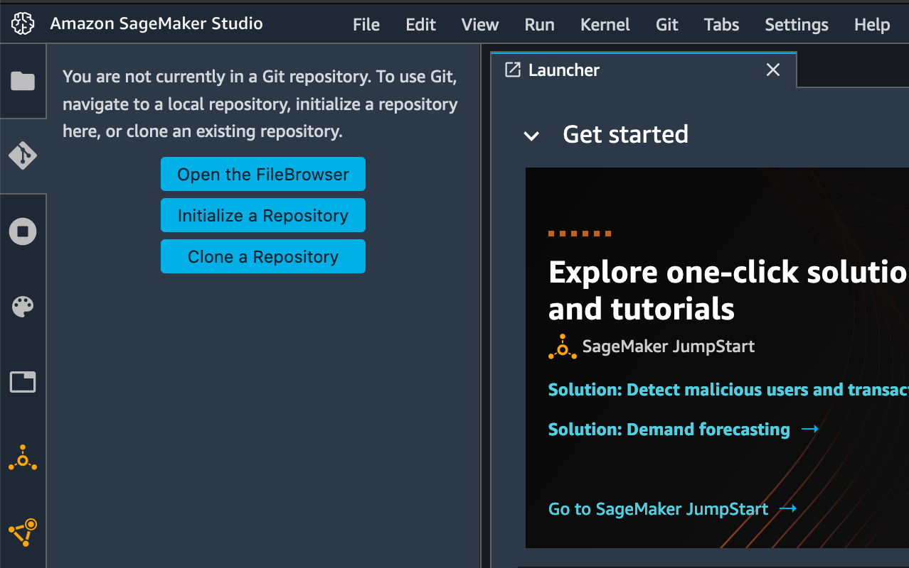

# Predict Bike Sharing Demand with AutoGluon

## Introduction to AWS Machine Learning Final Project

## Overview
In this project, students will apply the knowledge and methods they learned in the Introduction to Machine Learning course to compete in a Kaggle competition using the AutoGluon library.

Students will create a Kaggle account if they do not already have one, download the Bike Sharing Demand dataset, and train a model using AutoGluon. They will then submit their initial results for a ranking.

After they complete the first workflow, they will iterate on the process by trying to improve their score. This will be accomplished by adding more features to the dataset and tuning some of the hyperparameters available with AutoGluon.

Finally they will submit all their work and write a report detailing which methods provided the best score improvement and why. A template of the report can be found [here](report-template.md).

To meet specifications, the project will require at least these files:
* Jupyter notebook with code run to completion
* HTML export of the jupyter notebbook
* Markdown or PDF file of the report

Images or additional files needed to make your notebook or report complete can be also added.

## Getting Started
* Clone this template repository `git clone git@github.com:udacity/nd009t-c1-intro-to-ml-project-starter.git` into AWS Sagemaker Studio (or local development).




* Proceed with the project within the [jupyter notebook](project-template.ipynb).
* Visit the [Kaggle Bike Sharing Demand Competition](https://www.kaggle.com/c/bike-sharing-demand) page. There you will see the overall details about the competition including overview, data, code, discussion, leaderboard, and rules. You will primarily be focused on the data and ranking sections.

### Dependencies

```
Python 3.7
MXNet 1.8
Pandas >= 1.2.4
AutoGluon 0.2.0 
```

### Installation
For this project, it is highly recommended to use Sagemaker Studio from the course provided AWS workspace. This will simplify much of the installation needed to get started.

For local development, you will need to setup a jupyter lab instance.
* Follow the [jupyter install](https://jupyter.org/install.html) link for best practices to install and start a jupyter lab instance.
* If you have a python virtual environment already installed you can just `pip` install it.
```
pip install jupyterlab
```
* There are also docker containers containing jupyter lab from [Jupyter Docker Stacks](https://jupyter-docker-stacks.readthedocs.io/en/latest/index.html).

## Project Instructions

1. Create an account with Kaggle.
2. Download the Kaggle dataset using the kaggle python library.
3. Train a model using AutoGluon’s Tabular Prediction and submit predictions to Kaggle for ranking.
4. Use Pandas to do some exploratory analysis and create a new feature, saving new versions of the train and test dataset.
5. Rerun the model and submit the new predictions for ranking.
6. Tune at least 3 different hyperparameters from AutoGluon and resubmit predictions to rank higher on Kaggle.
7. Write up a report on how improvements (or not) were made by either creating additional features or tuning hyperparameters, and why you think one or the other is the best approach to invest more time in.

## License
[License](LICENSE.txt)


##  Directions

Paste the Github link of the repository. Use this link to clone the repository:

nd009t-c1-intro-to-ml-project-starter

It may ask you which kernel you want to use, please make sure you are using the Python 3 (MXNet 1.8 Python 3.7 CPU Optimized) Kernel.

It is recommended to use the ml.t3.medium (2v CPU, 4 GiB Memory) instance that is the default upon startup. While you can select a higher instance type, this instance should suffice.

Before leaving your Sagemaker Studio workspace, always be sure to shut down all running instances and kernels. You access the running instances on the left hand side tool bar.

Run command and get latest. 
### https://www.youtube.com/watch?v=K3ngZKF31mc

```
aws iam list-roles|grep SageMaker-Execution
```


```
conda activate base
```

cd into directory where project.ipynb
```
jupyter nbconvert --to html --execute notebook_name.ipynb --ExecutePreprocessor.kernel_name=python3

jupyter nbconvert --to html project.ipynb
```


  File "/opt/conda/lib/python3.10/site-packages/jupyter_client/kernelspec.py", line 285, in get_kernel_spec
    raise NoSuchKernel(kernel_name)
jupyter_client.kernelspec.NoSuchKernel: No such kernel named conda_python3

## Stand Out Suggestions
You completed the project notebook and wrote the report, but you are still looking for making your project even better. Here are some standout suggestions you might want to try. Remember these are optional, if you would rather submit your work as is that is perfectly fine, just skip the checklist below. Here are some suggestions that may be great themes for standout suggestions.

### Add more than one feature to the dataset and train models to see if it imporves the Kaggle score

### Perform mulptile rounds of hyperparameter tuning to see if it improves Kaggle's score

### Visualizations
- Time series of bike-sharing demand
- Plot correlation matrix of all features *Heatmap or scatter plot
- Plot model trining performnce with more than just the top model


Meets Specifications
Awesome 💯💯
Congratulations on finishing your project on time. 🏆🏆
I'm thrilled to inform you that you have not only met but exceeded all expectations and standards for the Predict Bike Sharing Demand project. Your performance throughout the project has been outstanding, showcasing a comprehensive understanding of the underlying concepts and proficient application of the techniques involved.

As an aspiring AWS ML engineer, you have demonstrated exceptional skills in leveraging AWS services and effectively implementing machine learning algorithms. Your ability to navigate and utilize AWS resources to enhance the project's performance is impressive. Your dedication and hard work are truly commendable, and it's evident that you have invested significant effort into mastering both the domain-specific knowledge and the technical skills required for an ML engineer.

Useful References:

Autogluon leaderboard [Documentation]
Exploratory Data Analysis with Pandas Profiling [Article]
Markdown Cheatsheet [Article]
Again, congrats on your outstanding achievement! Your perseverance and dedication have paid off, and you will unquestionably be successful in all of your future pursuits. I applaud your efforts and wish you success in all of your next undertakings, both academic and professional.

For any technical assistance, you can use Knowledge Portal as well.
Have a great day 🏆

PLEASE CONSIDER RATING MY EFFORTS AS A PROJECT REVIEWER! YOUR ADVICE IS MUCH VALUED AND APPRECIATED.
Loading the Dataset
Student uses the kaggle cli with the kaggle API token to download and unzip the Bike Sharing Demand dataset into Sagemaker Studio (or local development).

✅ You have used the kaggle cli with the kaggle API token to download

Excellent work! 👏
You have successfully downloaded the dataset using the Kaggle API. I encourage you to continue exploring and leveraging data from Kaggle to enhance your learning and data analysis capabilities. Well done!”

Some of the additional Kaggle API capabilities include:

Listing competitions: You can use the Kaggle API to list available competitions and retrieve information about them, such as competition names, IDs, descriptions, deadlines, and more.
Working with kernels: Kaggle kernels are a platform for creating and sharing code notebooks. The API allows you to create and manage kernels programmatically, including listing kernels, creating new kernels, forking existing kernels, updating kernel settings, and more.
Exploring datasets: Besides downloading datasets, the Kaggle API provides methods to explore available datasets. You can retrieve information about datasets, including metadata, descriptions, versions, file structures, and download URLs.
You can refer to the official Kaggle API documentation for more information and examples on how to utilize these features

References:
**Kaggle API Documentation. [Documentation]**

✅ You have correctly unzipped the Bike Sharing Demand dataset in your project notebook

Good Job.
The logs are perfect. The dataset is successfully decompressed. Here are some suggestions on how to leverage the unzip package effectively:

Handling password-protected zip files: If your zip file is password-protected, you can provide the password as an additional argument to the extract function. Here's an example:

  from unzip import extract

  zip_file_path = 'path/to/your/password_protected_file.zip'
  destination_dir = 'path/to/destination/directory'
  password = 'your_password'

  extract(zip_file_path, destination_dir, password=password)
Handling large zip files: If you're working with large zip files, you can enable the stream mode while extracting. This mode allows you to extract files from the zip archive without loading the entire archive into memory. Here's an example:

  from unzip import extract

  zip_file_path = 'path/to/your/large_file.zip'
  destination_dir = 'path/to/destination/directory'

  extract(zip_file_path, destination_dir, stream=True)
Student uses Panda’s read_csv() function to load the train/test/and sample submission file into DataFrames. Once loaded, they can view the dataframe in their jupyter notebook.

✅ You have successfully performed the read operation to load train, test, and sample submission files to respective dataframes.

Comments:
Perfect! you have loaded all the dataframes correctly without any issue. Your ability to efficiently read and load data is a crucial skill in data analysis and machine learning.
Standout:
Great to see you using 🔗parse_dates parameter to parse a datetime column while loading the data. Using the parse_dates parameter in pandas simplifies the process of working with time-related data.
It saves you from manual conversion tasks and unlocks the full range of time-series analysis capabilities available in pandas and other compatible libraries.


Some additional tips:
Dealing with different character encodings: The Pandas read_csv() function has an argument call encoding that allows you to specify an encoding to use when reading a file. For example:

  df.to_csv('data/data_1.csv', encoding='gb2312')
Dealing with columns: When your input dataset contains a large number of columns, and you want to load a subset of those columns into a DataFrame, then usecols will be very useful. Performance-wise, it is better.

  pd.read_csv('data/data_2.csv', usecols=['product', 'cost'])
References:
**Pandas Documentation [Documentation]**

Feature Creation and Data Analysis
Student uses data from one feature column and extract data from it to use in a new feature column.

✅ Student uses data from one feature column and extract data from it to use in a new feature column.

Awesome! You have effectively used datetime feature to derive features like:
day
dayofweek
hour
month
year
Deriving features from datetime variables provides several benefits in data analysis and machine learning tasks:

Seasonality and trends: Extracting features like month, day, or hour allows you to capture the seasonal patterns or daily/hourly trends in your data. This can help identify recurring patterns, understand cyclic behavior, and detect any time-related variations that might impact your analysis or modeling.
Temporal aggregations: By deriving features at different time granularities (e.g., day, month, year), you can perform temporal aggregations and summarize the data at different levels. This enables you to analyze trends over time, identify long-term patterns, or compare data across different time periods.
Feature engineering: Derived datetime features can serve as valuable inputs for machine learning models. They provide additional information and context that might be relevant for predicting the target variable.
References:
pandas Documentation - DatetimeProperties [Documentation]

Student creates a matplotlib image showing histograms of each feature column in the train dataframe.

✅ Student creates a matplotlib image showing histograms of each feature column in the train dataframe.

Awesome 👍
Good to see you incorporating the 🔗figsize parameter to increase the figure size.
Suggestions:
Here are a few additional techniques for visualizing the distribution of features in your dataset:

Kernel Density Plots: Kernel density plots provide a smooth estimation of the probability density function of a feature's distribution. It gives a visual representation of the underlying distribution without discrete bins. You can use the sns.kdeplot() function from the seaborn library to create kernel density plots.
Box Plots: Box plots, also known as box-and-whisker plots, provide a summary of the distribution by displaying the quartiles, median, and outliers of a feature. They are useful for identifying the central tendency, spread, and skewness of the data. The df.boxplot() method in pandas or the sns.boxplot() function in seaborn can be used to create box plots.
Empirical Cumulative Distribution Function (ECDF) Plots: ECDF plots show the cumulative distribution of a feature, providing insights into the overall distribution and percentiles of the data. You can use the statsmodels.api library's ECDF function to create ECDF plots.
Remember, the choice of visualization technique depends on the nature of the data and the specific insights you want to derive. Experiment with different plot types to find the most informative and meaningful representations of your feature distributions.

Student assigns category data types to feature columns that are typed as numeric values.

✅ Student assigns category data types to feature columns that are typed as numeric values.

Good work!
You have nicely dealt with category-based features. Using the categorical data type can provide several benefits, including:

Memory Efficiency: Categorical data types can significantly reduce memory usage compared to regular object or string data types. Categorical data is internally stored as integers, where each unique category is assigned a unique integer code. This integer representation consumes less memory than storing the actual string values. If you have a column with a limited number of unique values or a column that represents categories, converting it to the categorical data type can lead to substantial memory savings, especially for large datasets.
Improved Performance: Working with categorical data can improve the performance of certain operations. Categorical data allows for efficient operations like grouping, aggregating, and sorting. These operations can be faster when working with categorical data compared to object or string data types.
Ordered Categoricals: Categorical data types can have an inherent order defined among the categories. This ordered nature can be useful for variables with a natural ranking or hierarchy. For example, a categorical variable representing education levels (e.g., "High School," "Bachelor's Degree," "Master's Degree") can be ordered in a meaningful way. You can specify the order of categories using the ordered=True parameter when creating the categorical data type.
References:
🔗Using pandas categories properly is tricky, here’s why… [Article]

Model Training With AutoGluon
Student uses the TabularPredictor class from AutoGluon to create a predictor by calling .fit().

✅ You have instantiated the TabularPredictor class from AutoGluon to create a predictor.

Fantastic 💯
You have correctly instantiated the TabularPredictor object with all the necessary parameters.

Here are certain things you should keep in mind while fitting a TabularPredictor:

Consider Time and Resource Constraints: When instantiating TabularPredictor, consider specifying time and resource constraints based on your available computing resources and time limitations. This allows you to manage the model training process efficiently and prevents excessive resource usage or lengthy training times.
Experiment with Different Presets: AutoGluon provides various presets that encapsulate different configurations and settings. Experiment with different presets to explore their impact on model performance. Some popular presets include "medium_quality_faster_inference", "high_quality", or "best_quality". Test multiple presets to find the right balance between model performance and computational cost for your specific use case.
✅ Evaluation metric used is root_mean_squared_error

✅ Time limit set to “600” seconds.

✅ Presets set to “best_quality”

✅ casual and registered columns are ignored while fitting the model

Good catch! You have ignored the “["casual", "registered"]".
Casual Users: Casual users refer to individuals who rent bikes on a short-term or temporary basis, typically for recreational or leisure purposes. These users may include tourists, occasional riders, or individuals who do not have a long-term subscription or membership with the bike sharing service.
Registered Users: Registered users, on the other hand, are individuals who have subscribed or registered with the bike sharing service. These users often have long-term memberships or subscriptions and use the bike sharing service regularly for commuting or other purposes.
We are dropping these columns so that the model does not discriminate between casual and registered users since both users are important for the bike-sharing application. They both bring significant traffic.

Suggestions:
Try to use the learner_kwargs parameter to ignore the columns:

  TabularPredictor(
  learner_kwargs={"ignored_columns": ["casual", "registered"]}
  )
Reference:
🔗TabularPredictor Documentation

Student provides additional arguments in the TabularPredictor .fit() function to change how the model uses hyperparameters for training.

✅ Student provides additional arguments in the TabularPredictor .fit() function to change how the model uses hyperparameters for training.

Outstanding 🙌
You have incorporated a lot of parameters in your hyperparameter tuning.

AutoGluon's hyperparameter tuning functionality helps in automating the process of finding optimal hyperparameters, saving our time and effort compared to manual tuning. It explores the hyperparameter space efficiently and provides us with the best hyperparameters for our model, allowing us to achieve better performance and generalization on our dataset.

Note: It's worth noting that hyperparameter tuning can be computationally expensive, especially when searching a large space or using complex models. Therefore, it's important to allocate sufficient computational resources and set appropriate time limits or budget constraints to ensure efficient tuning without excessive resource consumption.

Suggestions:
There are many hyperparameter options. You can always reference them in this Autogluon 🔗documentation
Here is one detailed tutorial on Autogluon Hyperarameter tuning: Hyperparameter Tuning is Overrated Apply AutoGluon-Tabular, an AutoML Algorithm [Video Lecture]
Some additional tips (Only for future reference):
Do not specify the hyperparameter_tune_kwargs argument (counterintuitively, hyperparameter tuning is not the best way to spend a limited training time budgets, as model ensembling is often superior)
We recommend you only use hyperparameter_tune_kwargs if your goal is to deploy a single model rather than an ensemble.
Do not specify hyperparameters argument (allow AutoGluon to adaptively select which models/hyperparameters to use).
Student uses the predictor created by fitting a model with TabularPredictor to predict new values from the test dataset.

✅ Student uses the predictor created by fitting a model with TabularPredictor to predict new values from the test dataset.

Spot on! 🙌
You have handled all the negative values which might occur during the prediction of the values on the test set. We are doing so to ensure the realistic constraints are intact.
All the feature modification you did on the training dataset is also applied to the test dataset. Failure to do so can lead to mismatched feature columns and prevent us from making predictions on the test data.
Additional tips:
When we call predict(), AutoGluon automatically predicts with the model that displayed the best performance on validation data
We can instead specify which model to use for predictions like this:

  predictor.predict(test_data, model='LightGBM')
By setting as_pandas=True, the predicted output will be returned as a Pandas DataFrame. This can be useful if you want to easily manipulate, analyze, or further process the predictions using Pandas' functionality.

Compare Model Performance
Student uses the kaggle cli to submit their predictions from the trained AutoGluon Tabular Predictor to Kaggle for a public score submission.

✅ Student uses the kaggle cli to submit their predictions from the trained AutoGluon Tabular Predictor to Kaggle for a public score submission.

Excellent 💯
I didn’t find any issues in the logs returned by the kaggle APIs. The submission format was as per the template provided to you.

Additional Tips:
Verify File Format: Ensure that you are submitting the correct file format specified by the competition. Double-check if the competition requires a specific file extension, such as CSV, ZIP, or JSON.
Submission File Content: Confirm that your submission file contains the appropriate data in the correct structure and format. It should align with the submission requirements specified by the competition, such as the number of rows, columns, and the expected data format.
Submission Message: Include a meaningful and descriptive submission message to provide additional information about your submission. This message can help you track and understand the purpose of each submission you make. For example, you can mention the approach or techniques used, or any specific details you want to highlight.
References:
**Kaggle API Documentation. [Documentation]**

Student uses matplotlib or google sheets/excel to chart model performance metrics in a line chart. The appropriate metric will be derived from the either fit_summary() or leaderboard() of the predictor. Y axis is the metric number and X axis is each model iteration.

✅ You have successfully used the Matplotlib to chart model performance metrics in a line chart.

✅ Appropriate metric derived from the fit_summary() method.

✅ Y axis is the metric number and X axis is each model iteration.

Great Job on successfully utilizing Matplotlib to create a line chart showcasing the model performance metrics.
By accessing the fit_summary() output, you have gained access to essential information about the training metrics, such as training and validation loss, accuracy, or other performance measures.

Suggestions:
More appropriate way to fetch the performance metrics is to use [predictor's leaderboard method]:

  "score": [predictor.leaderboard(silent=True)['score_val'][0],
          predictor_new_features.leaderboard(silent=True)['score_val'][0],
          predictor_new_hpo.leaderboard(silent=True)['score_val'][0]]
To output predicted class probabilities instead of predicted classes, you can use:

  predictor.predict_proba(datapoint)  # returns a DataFrame that shows which probability corresponds to which class
The expanded leaderboard shows properties like how many features are used by each model (num_features), which other models are ancestors whose predictions are required inputs for each model (ancestors), and how much memory each model and all its ancestors would occupy if simultaneously persisted (memory_size_w_ancestors). See the leaderboard documentation for full details.

  predictor.leaderboard(extra_info=True, silent=True)
Student uses matplotlib or google sheets/excel to chart changes to the competition score. Y axis is the kaggle score and X axis is each model iteration.

✅ You have successfully used Matplotlib to chart changes to the competition score

✅ Y axis is the kaggle score and X axis is each model iteration

Congratulations on successfully plotting the Kaggle score vs. model chart!
Your efforts in retrieving the scores from the Kaggle competition submission API and visualizing them in a chart format demonstrate your excellent skills in data analysis and visualization.

For the Bike Sharing Demand competition, the evaluation metric used to calculate the Kaggle score is the Root Mean Squared Logarithmic Error (RMSLE). The RMSLE metric measures the difference between the logarithm of the predicted count and the logarithm of the actual count. A lower RMSLE score indicates better performance, with a perfect score of 0 representing an exact match between the predicted and actual counts.


References:
Hyperparameter tuning a custom model with TabularPredictor [Documentation]
Hyperparameter Tuning is Overrated Apply AutoGluon-Tabular, an AutoML Algorithm [Video Lecture]
Competition Report
The submitted report makes use of fit_summary() or leaderboard() to detail the results of the training run and shows that the first entry will be the “best” model.

✅ The submitted report makes use of fit_summary() or leaderboard() to detail the results of the training run and shows that the first entry will be the “best” model.

Congratulations on successfully identifying the best model from the fit_summary output!
Identifying the best model is a crucial step in any machine learning or data analytics project. It allows you to focus your efforts on the most promising model and make informed decisions based on its performance.

Additional Tips:
You can also use [leaderboard](https://auto.gluon.ai/stable/api/autogluon.tabular.TabularPredictor.leaderboard.html) method to pull the best model name. Here's an example code snippet that demonstrates how to pull the best model using the leaderboard in AutoGluon:

from autogluon.tabular import TabularPredictor

# Train multiple models using AutoGluon
predictor = TabularPredictor(...)
predictor.fit(...)

# Generate the leaderboard
leaderboard = predictor.leaderboard()

# Retrieve the best model
best_model_name = leaderboard.iloc[0]['model']
best_model = predictor.get_model(best_model_name)
In this example, TabularPredictor is initialized and trained using AutoGluon. The leaderboard() method is then called to generate the leaderboard. The first entry in the leaderboard represents the best model. You can retrieve the name of the best model using leaderboard.iloc[0]['model'] and obtain the corresponding model object using predictor.get_model(best_model_name).

The submitted report discusses how adding additional features and changing hyperparameters led to a direct improvement in the kaggle score.

✅ Report discusses how adding additional features led to a direct improvement in the kaggle score

Great job on your project report!
I was impressed to see how you discussed the impact of adding additional features on the Kaggle score and how it directly led to an improvement in performance. This demonstrates your strong analytical skills and understanding of feature engineering.

I encourage you to continue exploring different feature engineering techniques and experimenting with additional variables to further enhance your models' performance.

✅ Report how changing hyperparameters led to a direct improvement in the kaggle score

Awesome!
Your report effectively explains the rationale behind modifying the hyperparameters and how each change contributed to the improvement in the Kaggle score. This level of detail helps readers understand the impact of hyperparameter choices on model behavior and performance.

I encourage you to continue exploring different hyperparameter optimization techniques and consider more advanced methods like Bayesian optimization or genetic algorithms. By further refining your hyperparameter tuning process, you can potentially achieve even better results.

References:
Hyperparameter tuning a custom model with TabularPredictor [Documentation ]
Hyperparameter Tuning is Overrated Apply AutoGluon-Tabular, an AutoML Algorithm [Video Lecture]
The submitted report contains a table outlining each hyperparameter uses along with the kaggle score received from each iteration.

The report contains an explanation of why certain changes to a hyperparameter affected the outcome of their score.

✅ The submitted report contains a table outlining each hyperparameter uses along with the kaggle score received from each iteration. The report contains an explanation of why certain changes to a hyperparameter affected the outcome of their score.

Great Work 🙌
The inclusion of such a table is vital as it allows readers to easily visualize and analyze the relationship between hyperparameters and the corresponding Kaggle scores. It demonstrates your thoroughness in documenting and presenting the results of your hyperparameter tuning experiments.

References:
Use this website to get the basic outline for the markdown table. [Website]
Markdown Cheatsheet [Article]
