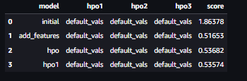

# Report: Predict Bike Sharing Demand with AutoGluon Solution
#### Elizabeth Bradley

## Initial Training
### What did you realize when you tried to submit your predictions? What changes were needed to the output of the predictor to submit your results?

The initial realization was that the AutoGluon Tabular Prediction preset 'best quality' was too resource intensive to create a model. Switching to 'medium_quality_faster_train' allowed the model to be created.

### What was the top ranked model that performed?
The top-ranked model that performed was the hyperparameter optimized model, hpo_model. This used the WeightedEnsemble_L2 model with a validation RMSE score of 35.594567.

## Exploratory data analysis and feature creation
### What did the exploratory analysis find and how did you add additional features?
Creating a histogram of all features the datetime distrubtion stood out. Every data point on the x axis had a high count with small variability. It was clear that this feature needed to be split in order to reveal the driver of high bike rentals.

Indeed splitting the datetime feature into hour yielded significance insights into the relationship between time and bike rental demand. A bar char of count vs hour visually depicts this relationship. Based on this data, bike rental demand peaked at 8 am and 5 pm. This suggest people rent bikes to go to work.

### How much better did your model preform after adding additional features and why do you think that is?
After adding the new features the model performed much better with a RMSE value of 34.933 and a Kaggle score of 0.51653. The hour of the day seems to be the primary driver of bike rental demand.

## Hyper parameter tuning
### How much better did your model preform after trying different hyper parameters?
Two hyper parameter models were run with different tunings. The first hpo use LightGMBLarge and WeightedEnsemble_L2 models with a RMSE value of 38.74 and a Kaggle score of 0.53682. Overall this parameter tuning did not make a significant diffence in predicting bike rental demand. The second hpo produced similar results as the first hpo.

### If you were given more time with this dataset, where do you think you would spend more time?
I would search for additional features to explain bike rental demand. This would involve collecting more data about where the renters lived and worked as well as bike rental locations and rates.

### Create a table with the models you ran, the hyperparameters modified, and the kaggle score.
|model|hpo1|hpo2|hpo3|score|
|--|--|--|--|--|
|initial|?|?|?|?|
|add_features|?|?|?|?|
|hpo|?|?|?|?|

### Create a line plot showing the top model score for the three (or more) training runs during the project.

### Create a line plot showing the top kaggle score for the three (or more) prediction submissions during the project.

TODO: Replace the image below with your own.

## Summary
The process of initial training, exloratory data analysis, feature creation, and hyperparameter tuning resulted in improving the model performance. The new feature of hour enhanced the model's predictive power. Given more time, hyperparameter tuning further would optimized the model performance. The results highlight the importance of feature engineering and how critical hyperparameter tuning is to creating successful predictive models.